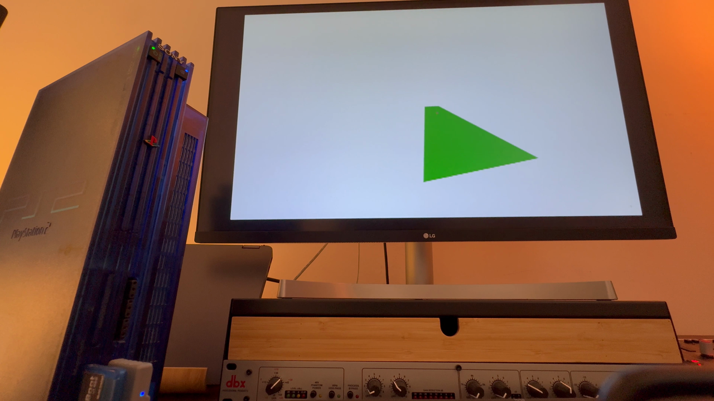

<h1 align="center">Pantheon</h1>

<p align="center"><strong>A Path 1 PlayStation 2 engine built around the Emotion Engine and VU1.</strong></p>

<p align="center">
  <a href="https://github.com/94BILLY/PANTHEON/tags"></a>
  
  
  
</p>

<p align="center">
  
</p>

<p align="center"><sub>Phase 1 whitebox · retail PS2 capture</sub></p>

<br />

## Overview

The **EE** issues **DMA / VIF1** work; **VU1** runs **`shader.vsm`** — transform, GIF packing, **XGKICK** to the **GS**. Offline tools **`hrc2ps2.py`** and **`obj2ps2.py`** emit mesh data in the layout the reference **`floor.elf`** expects.

> Engineering record and reproducibility baseline — not a generic game template.

---

## Build

```bash
git clone https://github.com/94BILLY/PANTHEON.git
cd PANTHEON
make -f Makefile.world
```

**Artifact:** `floor.elf` (stripped). Run in **PCSX2** or on hardware. Toolchain and profiles: **[`GETTING_STARTED.md`](GETTING_STARTED.md)**.

---

## Phase 1 baseline · v1.0.0-Beta

| | |
| :--- | :--- |
| **Shipped** | **WWW.94BILLY.COM** boot, timecycle skydome, walkable floor, third-person orbit camera |
| **Default profile** | Hybrid — CPU GIF floor and Path 1 skydome (avoids coplanar Z-fighting) |
| **Strict Path 1** | Documented in **[`BETA_RELEASE.md`](BETA_RELEASE.md)** |

**[`GETTING_STARTED.md`](GETTING_STARTED.md)** — build and run · **[`FLIGHT_LOG.md`](FLIGHT_LOG.md)** — how it was built

---

## Core files

| File | Role |
| :--- | :--- |
| [`pantheon_path1_contract.h`](pantheon_path1_contract.h) | EE ↔ VU1 memory layout and batch contract |
| [`pantheon_vram.h`](pantheon_vram.h) | GS VRAM allocator declarations |
| [`pantheon_vram.c`](pantheon_vram.c) | Linear bump allocator, alignment, layout telemetry |
| [`shader.vsm`](shader.vsm) | VU1 microprogram: transform, near-Z, GIF packets, XGKICK |
| [`floor.c`](floor.c) | EE conductor: DMA chains, boot, world |

---

## Media & site

Captures from **retail PS2**. Gallery: [`docs/media/VIEW_PANTHEON_MEDIA.html`](docs/media/VIEW_PANTHEON_MEDIA.html).

| | |
| :--- | :--- |
| **Loops** | [`loop-boot-to-world.gif`](docs/media/loop-boot-to-world.gif) · [`loop-world-orbit.gif`](docs/media/loop-world-orbit.gif) |
| **Stills** | [`still-rgb-proof.png`](docs/media/still-rgb-proof.png) · [`still-world-hero.png`](docs/media/still-world-hero.png) |

Phone masters stay local (gitignored). **94billy.com:** [`docs/pantheon-94billy.html`](docs/pantheon-94billy.html) · WordPress source: [`docs/pantheon-landing.html`](docs/pantheon-landing.html).

---

## Scope

**`floor.elf`** is a fixed whitebox: boot title, outdoor sky, ground plane, orbit camera, DualShock input. Defaults and flags: **[`BETA_RELEASE.md`](BETA_RELEASE.md)** · Acceptance: **[`BASELINE_ACCEPTANCE.md`](BASELINE_ACCEPTANCE.md)**.

---

## Audience

Developers who already ship with **PS2SDK** and want a concrete Path 1 reference. Entry points: **`pantheon_path1_contract.h`** and **`shader.vsm`**. EE / VIF / VU / GS familiarity is assumed.

---

## Documentation

| Document | Contents |
| :--- | :--- |
| [`GETTING_STARTED.md`](GETTING_STARTED.md) | Toolchain, build, PCSX2, profiles, assets, troubleshooting |
| [`BETA_RELEASE.md`](BETA_RELEASE.md) | Hybrid vs strict defaults for v1.0.0-Beta |
| [`HANDOFF.md`](HANDOFF.md) | Doc index, SCE reference paths |
| [`BASELINE_ACCEPTANCE.md`](BASELINE_ACCEPTANCE.md) | Acceptance criteria |
| [`CHANGELOG.md`](CHANGELOG.md) | Version history |
| [`FLIGHT_LOG.md`](FLIGHT_LOG.md) | Development log |

**Tags:** [github.com/94BILLY/PANTHEON/tags](https://github.com/94BILLY/PANTHEON/tags)

---

## Roadmap

| Phase | Focus |
| :--- | :--- |
| **2** — Texture / STQ | Texture coordinates, **STQ**, sampling in VU1 |
| **3** — Terrain / scale | Chunking within **16 KB** VU1 data memory |
| **4** — Atmosphere | Timecycle and sky |

---

## Repository policy

Public record. **No** `LICENSE` — all rights reserved. Issues, pull requests, and unsolicited contributions are **not** accepted. Redistribution requires **written permission**.

<p align="center">
  <br />
  <strong><a href="https://github.com/94BILLY/PANTHEON">github.com/94BILLY/PANTHEON</a></strong><br />
  <sub>94BILLY · <a href="https://www.94billy.com">94billy.com</a></sub>
  <br /><br />
  <sub>© 2026 94BILLY. All rights reserved. Viewing permitted. No reuse without written permission.</sub>
</p>

<details>
<summary><strong>Maintainer — GitHub metadata</strong></summary>

**Repository description (one line):**

```text
Bare-metal Path 1 PlayStation 2 engine. VU1 microcode. Softimage 3D pipeline. 60 FPS target.
```

**Topics:** `ps2`, `playstation2`, `homebrew`, `vu1`, `path1`, `gamedev`, `openworld`, `softimage`, `bare-metal`, `demoscene`

</details>
