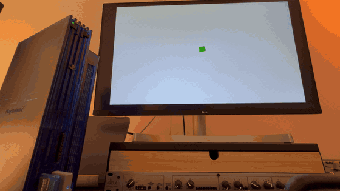

# Pantheon

**PANTHEON** is a **Path 1** PlayStation 2 stack: the **EE** runs as **DMA/VIF1 conductor**, **VU1** runs **`shader.vsm`** (transform, GIF pack, **XGKICK** to **GS**). Not Path 3. Not “engine” abstraction—**silicon-shaped** work: quadword alignment, unpack layout, VRAM map, **near–Z** rejects, contract in `pantheon_path1_contract.h`.

Offline mesh paths: **Softimage `.hrc` → `hrc2ps2.py`**, **Wavefront `.obj` → `obj2ps2.py`**—data lands in the shape the bus expects.

Path 1 on PlayStation 2 has a learning curve. **GETTING_STARTED.md** covers toolchain, build, and run; **HANDOFF.md** points to SCE documentation and reference paths if you want to dig into the hardware story.

**This repository is a public showcase** of the work. There is **no** `LICENSE`; rights are **not** granted to copy, redistribute, or reuse the code without **written permission**. **Issues, pull requests, and contributions are not accepted.**

---

## Media (real hardware)

Whitebox demo captured **on a retail PS2** (not emulation). In-repo previews (after clone): [`docs/media/`](docs/media/).

| Asset | Role |
| --- | --- |
| [`pantheon-ps2-boot-4586.gif`](docs/media/pantheon-ps2-boot-4586.gif) | Short boot / title legibility |
| [`pantheon-ps2-world-4587.gif`](docs/media/pantheon-ps2-world-4587.gif) | Floor, skydome, camera motion |
| [`pantheon-hero-world-4587.png`](docs/media/pantheon-hero-world-4587.png) | Still hero — PS2 + Path 1 world (1280 px) |
| [`pantheon-hero-boot-4586.png`](docs/media/pantheon-hero-boot-4586.png) | Still — shorter clip / alternate crop |

Source phone videos (`IMG_4586.MOV`, `IMG_4587.MOV`) stay **local**—they are gitignored (~4K, ~0.8 GB combined).

## What’s in the tree

- **Path 1 end-to-end** — EE chains, VU1 kick, contract headers.
- **VRAM discipline** — linear allocator, alignment, optional boot layout audit.
- **Hybrid & strict profiles** — default avoids CPU vs VU1 floor Z-fight; strict validates full Path1 floor + skydome ([`BETA_RELEASE.md`](BETA_RELEASE.md)).
- **Skydome + timecycle** — smoothed palettes; defaults documented (long day cycle, overcast bias).
- **Boot** — luma ramp + **WWW.94BILLY.COM** bitmap title; Path1 world gated until reveal completes.

## Baseline

Locked **60 FPS** target for this whitebox: floor grid, skydome, boot overlay, orbit camera. **Pantheon the game** is intended to **grow from this same codebase**; what you see today is the **foundation**, not the shipping title.

## Roadmap (directional)

- Phase 2 — texture / **STQ** / sampling in microcode.
- Terrain / chunking — respect **16 KB** VU1 data ceiling at scale.
- Atmosphere — continued timecycle work.

---

**Versioning:** [SemVer 2.0](https://semver.org/). Pre-release tag **`v1.0.0-beta`**; next **`v1.0.1-beta`**, …; first RTM **`v1.0.0`**. [Tags](https://github.com/94BILLY/PANTHEON/tags).

**Build:** `make -f Makefile.world` → `floor.elf`. Pinned defaults: [`BETA_RELEASE.md`](BETA_RELEASE.md). Full setup and troubleshooting: [`GETTING_STARTED.md`](GETTING_STARTED.md).

**Docs:** [`GETTING_STARTED.md`](GETTING_STARTED.md) · [`BETA_RELEASE.md`](BETA_RELEASE.md) · [`FLIGHT_LOG.md`](FLIGHT_LOG.md) · [`HANDOFF.md`](HANDOFF.md) · [`BASELINE_ACCEPTANCE.md`](BASELINE_ACCEPTANCE.md) · [`CHANGELOG.md`](CHANGELOG.md)

**Repository:** [github.com/94BILLY/Pantheon](https://github.com/94BILLY/Pantheon) · **94BILLY**

© 2026 94BILLY. All rights reserved. Viewing permitted. No reuse without written permission.
