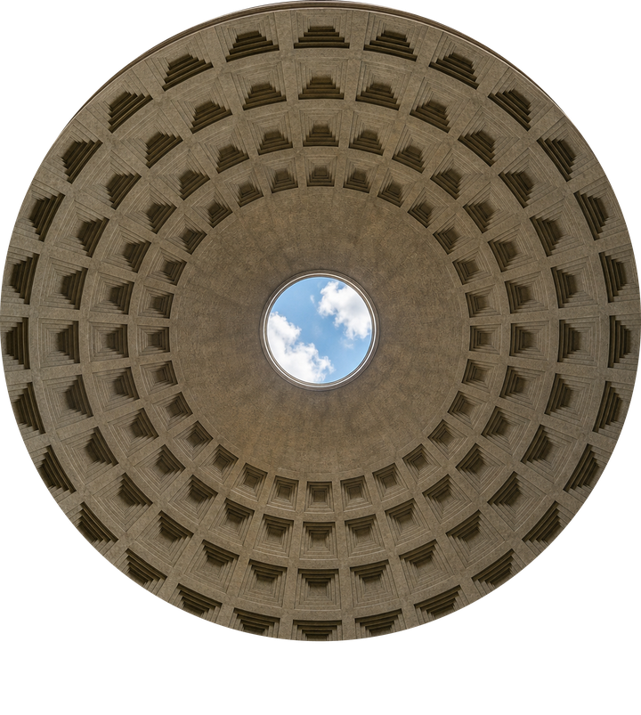
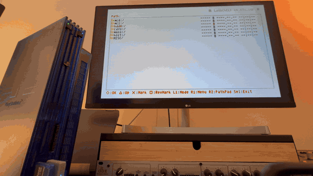

<h1 align="center" style="margin-top:0;margin-bottom:0;">
  <br />
  <span style="display:inline-block;margin-top:2px;">PANTHEON</span>
</h1>
<p align="center">A Path 1 game engine for the Sony® PlayStation 2 — Emotion Engine, VU1, DMA/VIF.</p>
<p align="center">
  
</p>
<p align="center"><sub>Boot → world · loop from retail capture (<code>docs/media/loop-boot-to-world.gif</code>)</sub></p>

## Overview

The Emotion Engine issues DMA/VIF work; VU1 runs `shader.vsm` (transform, GIF packing, XGKICK to the GS). Offline tools `hrc2ps2.py` and `obj2ps2.py` emit mesh data for the reference `floor.elf`.

## Build

```bash
git clone https://github.com/94BILLY/PANTHEON.git
cd PANTHEON
make -f Makefile.world
```

Output: `floor.elf`. Run in PCSX2 or on real PS2 hardware. Toolchain and profiles: [`GETTING_STARTED.md`](GETTING_STARTED.md).

## Phase 1 baseline

- Boot title, timecycle skydome, walkable floor, third-person orbit camera
- Default: hybrid profile (CPU GIF floor + Path 1 skydome; avoids coplanar Z-fight)
- Strict Path 1: [`BETA_RELEASE.md`](BETA_RELEASE.md)

Narrative: [`FLIGHT_LOG.md`](FLIGHT_LOG.md)

## Core files

| | |
| :--- | :--- |
| `pantheon_path1_contract.h` | EE ↔ VU1 memory layout |
| `pantheon_vram.h` / `pantheon_vram.c` | GS VRAM allocator |
| `shader.vsm` | VU1 microprogram |
| `floor.c` | EE conductor: DMA, boot, world |

## Media and site

Logo source and generator: [`docs/pantheon-oculus-straight-on-zenith.png`](docs/pantheon-oculus-straight-on-zenith.png) · [`tools/generate_pantheon_zenith_logos.py`](tools/generate_pantheon_zenith_logos.py) · [`docs/LOGO.md`](docs/LOGO.md)

Gallery (Retail PS2): [`docs/media/VIEW_PANTHEON_MEDIA.html`](docs/media/VIEW_PANTHEON_MEDIA.html) — loops and stills under `docs/media/`.

## Scope

`floor.elf` is a fixed whitebox (boot, sky, ground plane, orbit camera, DualShock). Flags and defaults: [`BETA_RELEASE.md`](BETA_RELEASE.md) · [`BASELINE_ACCEPTANCE.md`](BASELINE_ACCEPTANCE.md)

## Audience

Readers comfortable with PS2SDK, EE/VIF/VU1, and the GS. Start with `pantheon_path1_contract.h` and `shader.vsm`.

## Documentation

| | |
| :--- | :--- |
| [`GETTING_STARTED.md`](GETTING_STARTED.md) | Build, PCSX2, profiles, assets |
| [`BETA_RELEASE.md`](BETA_RELEASE.md) | Hybrid vs strict (v1.0.0-Beta) |
| [`DOCS_INDEX.md`](DOCS_INDEX.md) | Doc index |
| [`BASELINE_ACCEPTANCE.md`](BASELINE_ACCEPTANCE.md) | Acceptance |
| [`CHANGELOG.md`](CHANGELOG.md) | History |
| [`FLIGHT_LOG.md`](FLIGHT_LOG.md) | Development log |

## Roadmap

- Phase 2 — Texturing (STQ coordinates, texture sampling in VU1, GS upload)
- Phase 3 — Scale (world chunking within VU1 data limits)
- Phase 4 — Atmosphere (full dynamic timecycle, day/night sky transition)

## Repository policy

Public technical record. No `LICENSE` file; all rights reserved. Issues, pull requests, and unsolicited contributions are not accepted. Redistribution requires written permission.

---

<p align="center">
  <a href="https://github.com/94BILLY/PANTHEON">github.com/94BILLY/PANTHEON</a><br />
  94BILLY · <a href="https://www.94BILLY.com/PANTHEON">94billy.com/PANTHEON</a>
</p>
<p align="center"><sub>© 2026 94BILLY · All rights reserved</sub></p>

<details>
<summary>Maintainer — GitHub metadata</summary>

**Description (one line):**

```text
Bare-metal Path 1 PlayStation 2 engine. VU1 microcode. Softimage 3D pipeline. 60 FPS target.
```

**Topics:** `ps2` `playstation2` `homebrew` `vu1` `path1` `gamedev` `openworld` `softimage` `bare-metal` `demoscene`

</details>
